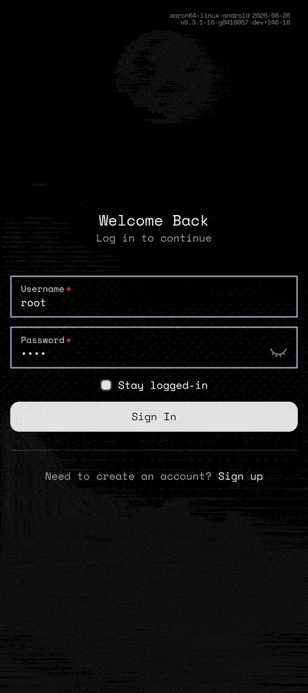

# dailies

a proof of concept for a gamified habit tracker app I'm working on, built using [tauri](https://tauri.app/) and [nextjs](https://nextjs.org/).

nothing is documented yet, but here is a short clip showing some current functionality.

  

### TODO

- [ ] write real README
